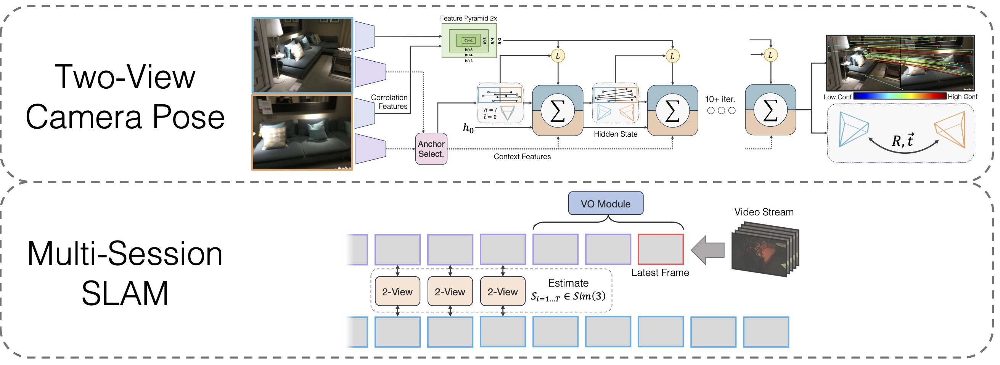
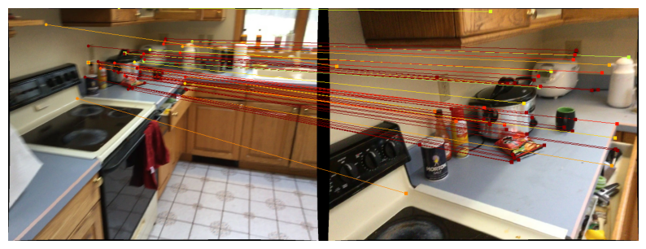
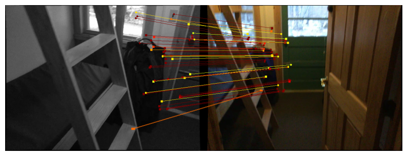

## Multi-Session SLAM with Differentiable Wide-Baseline Pose Optimization

This repository contains the source code for our paper:

<a href="https://arxiv.org/pdf/2404.15263.pdf">Multi-Session SLAM with Differentiable Wide-Baseline Pose Optimization</a>

<a href="https://www.lahavlipson.com/">Lahav Lipson</a>, <a href="http://www.cs.princeton.edu/~jiadeng">Jia Deng</a>

```
@inproceedings{lipson2024multi,
  title={Multi-Session SLAM with Differentiable Wide-Baseline Pose Optimization},
  author={Lipson, Lahav and Deng, Jia},
  booktitle={Proceedings of the IEEE/CVF Conference on Computer Vision and Pattern Recognition},
  year={2024}
}
```

<p align="center">
  
</p>

### Installation

```
git clone --recursive git@github.com:princeton-vl/MultiSlam_DiffPose.git
cd MultiSlam_DiffPose
conda env create --file environment.yml --name msdp
conda activate msdp
```

You will also need to install the third party libraries *hloc*

```shell
cd thirdparty/Hierarchical-Localization
python -m pip install -e .
cd ../..
```
and *eigen*

```shell
wget https://gitlab.com/libeigen/eigen/-/archive/3.4.0/eigen-3.4.0.zip
unzip eigen-3.4.0.zip -d thirdparty
```

Finally, run
```shell
pip install .
```

**Download model weights**

We provide the model weights for the VO backbone, the two-view backbone, and the two-view backbone after homography pre-training:

[https://drive.google.com/drive/folders/11iC4ZAmO_mWMUjkpS83HgVcS80hFL-30?usp=sharing](https://drive.google.com/drive/folders/11iC4ZAmO_mWMUjkpS83HgVcS80hFL-30?usp=sharing)


### Two-view Demo

Run `conda install jupyter` if not done previously.

We provide notebooks to demo our two-view pose method. The function `run_model(model, images, intrinsics)` outputs a list of intermediate predictions of pose/matches. The last (best) prediction is of the form

```math
predictions[-1] = (pts1 \in {\Bbb R}^{N \times 2}, pts2 \in {\Bbb R}^{N \times 2}, confidence \in {\Bbb R}^{N}, rel\_pose \in {\Bbb R}^{4\times 4})
```

To visualize predictions on Scannet / megadepth, [follow the two-view data download instructions](#evaluationdemo-data-preparation) and run
```
jupyter notebook demo_scannet_megadepth.ipynb
```
<p align="center">
  
  
</p>

To visualize a prediction on any image pair, edit and run `demo_pair.ipynb`

```shell
jupyter notebook demo_pair.ipynb
```

### Evaluation/Demo Data Preparation

**Two-View**

The authors of LoFTR generously provide the testing sets for Scannet and Megadepth. [Download](https://drive.google.com/drive/folders/1nTkK1485FuwqA0DbZrK2Cl0WnXadUZdc?usp=drive_link) and unpack them into 
`data/scannet/scannet_test_1500/` and `data/megadepth/megadepth_test_1500/`, respectively.

```shell
untar megadepth_test_1500.tar -C data/megadepth/
untar scannet_test_1500.tar -C data/scannet/
```

**Multi-Session SLAM**

*EuRoC*: Download the sequences from the EuRoC dataset [here](https://projects.asl.ethz.ch/datasets/doku.php?id=kmavvisualinertialdatasets). Make sure to download the ASL format. Unpack the sequences under `data/EuRoC`

*ETH3D*: You can download the sequences from the ETH3D training dataset using their provided script [download_eth3d_slam_datasets.py](https://www.eth3d.net/data/slam/download_eth3d_slam_datasets.py). You can select mono, RGB only. Unpack the sequences under `data/ETH3D`

### Evaluation

**Multi-Session SLAM**

To evaluate our full Multi-Session SLAM approach on all EuRoC sequence groups, run

```shell
python eval_euroc.py 'Vicon 1'
python eval_euroc.py 'Vicon 2'
python eval_euroc.py 'Machine Hall'
python eval_euroc.py 'Machine Hall0-3'
```

To evaluate our method on the ETH3D sequence groups, run

```shell
python eval_eth3d.py sofa
python eval_eth3d.py table
python eval_eth3d.py plant_scene
python eval_eth3d.py einstein
python eval_eth3d.py planar
```
Both scripts follow the same template. Extending the pipeline to new data only requires implementing a dataloader for loading images and intrinsics.

**Two-view Pose**

To evaluate our two-view pose method on Scannet, run
```shell
python evaluate.py --dataset test_scannet --load_ckpt twoview.pth -o ScanNetDatasetWrapper.pad_to_size=840
```
For Megadepth, run
```shell
python evaluate.py --dataset test_megadepth --load_ckpt twoview.pth
```

### Training

**Data download**

*Synthetic Homographies*: Run the download script in [https://github.com/filipradenovic/revisitop](https://github.com/filipradenovic/revisitop) to download the Oxford-Paris distractors dataset. Store the files under `data/revisitop1m/jpg/`

*Scannet/Megadepth*: Follow the instructions from the LoFTR training data setup: [https://github.com/zju3dv/LoFTR/blob/master/docs/TRAINING.md](https://github.com/zju3dv/LoFTR/blob/master/docs/TRAINING.md). Unpack the `*_indices.tar` into `index` subfolders. 

*VO data download*: To download the data for training the VO backbone, follow the download instructions from the [DROID-SLAM](https://github.com/princeton-vl/DROID-SLAM) repo.

The full data layout should be as follows:


```Shell
├── data
    ├── revisitop1m
        ├── jpg
        ├── revisitop1m.txt
    ├── scannet
        ├── index
        ├── scannet_test_1500
        ├── train
    ├── megadepth
        ├── index
        ├── scannet_test_1500
        ├── train
    ├── TartanAir
        ├── abandonedfactory
        ├── ...
```

**Homography Two-view Pre-training**

On one or several A6000s (we used 1), run

```shell
python train.py -g train_homog.gin --batch_size 14 --name homog_pretrain
mv model_weights/homog_pretrain/step_140000.pth homog_pretrain.pth
```

**Two-view full training**


On one or several A6000s (we used 10), run

```shell
python train.py -g train_pose.gin --batch_size 12 --name twoview --load_ckpt homog_pretrain.pth
mv model_weights/twoview/step_100000.pth twoview.pth 
```

**VO training**

On one or several A6000s (we used 1), run

```shell
python train_vo.py --steps=240000 --lr=0.00008 --name=vo
mv checkpoints/vo_240000.pth vo.pth
```

### Acknowledgements

This project relies on code from existing repositories:

- [*Hierarchical-Localization*](https://github.com/cvg/Hierarchical-Localization/)
- [*LoFTR*](https://github.com/zju3dv/LoFTR)
- [*DPVO*](https://github.com/princeton-vl/DPVO)
- [*Pytorch3D*](https://github.com/facebookresearch/pytorch3d)

Thank you to the authors for open-sourcing their code
